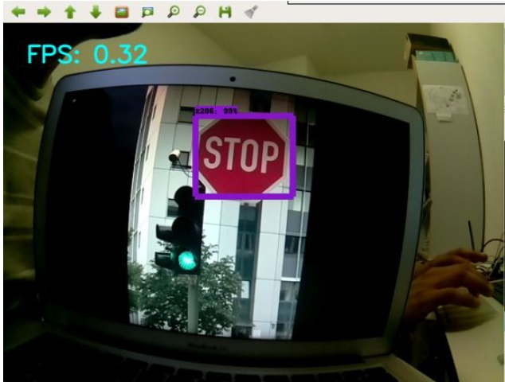
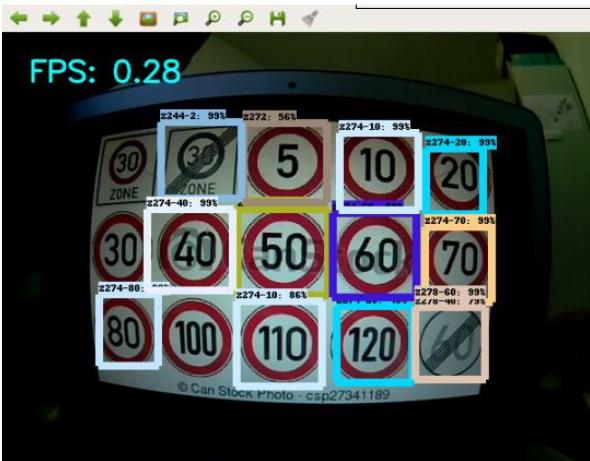

# Traffic-Sign-Detection
## Traffic Sign Detection on Raspberry Pi using Intel Movidius Stick

### Real time Traffic Sign Detection on a pre-trained neural network using a Pi-Camera Module.
 Detecting Stop Sign and Speed Indicators

### This project is performed in two parts:

### Part 1: 
Utilizing the Intel Neural Compute Movidius Stick (NCS) with RaspberryPi to improve the inference speed and frame rate (FPS) of the Object detector.

### Part 2: 
Deploying the Tensorflow Network on the RaspberryPi module and launching it as a ROS package.
